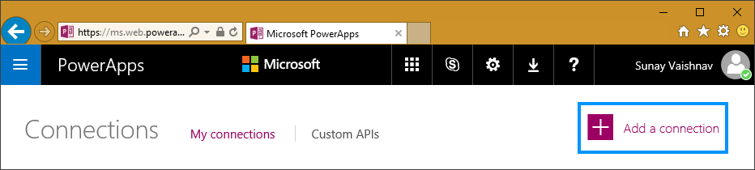
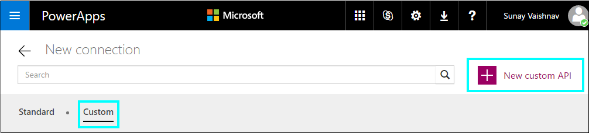
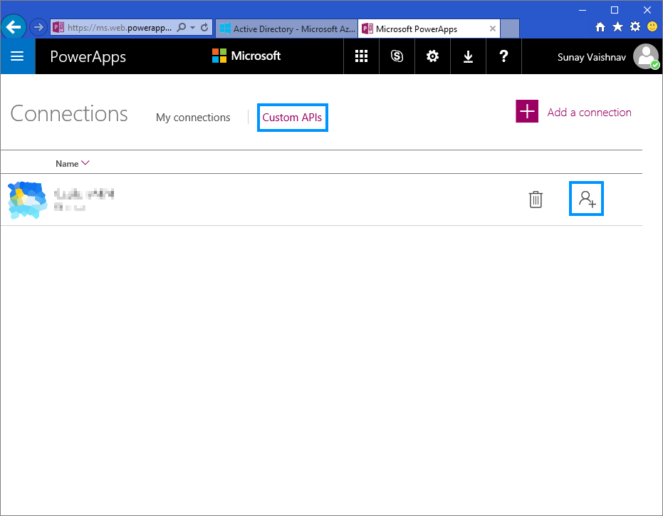

## How to use Custom APIs with PowerApps and Logic Flows

Custom APIs are simply any RESTful APIs that you can use bring in and use with your PowerApps and Logic Flows.
The APIs that you register with PowerApps can be hosted anywhere, as long as a well-documented specification that conforms to the [OpenAPI](https://openapis.org/specification) standard is available.

#### Authentication

You can use one of the two authentication mechanisms supported today: 
##### - Basic Authentication
##### - OAuth 2.0
*Support for API key authentication is coming soon.*

Following is the list of all the supported OAuth 2.0 providers, with support for more coming soon

- Azure Active Directory
- Box
- Dropbox
- Facebook
- Google
- Instagram
- OneDrive
- SalesForce
- Slack
- Yammer

You can learn more about how to specify the authentication type in your OpenAPI (Swagger) document [here](https://github.com/OAI/OpenAPI-Specification/blob/master/versions/2.0.md#securityDefinitionsObject). 
If your API endpoint allows for unauthenticated access, you should omit the securityDefintion object from the OpenAPI (Swagger) document.

### Examples
* [Azure Resource Manager](./AzureResourceManager/README.md)

### How to create a Custom API

Head on over to the PowerApps [web portal](https://web.powerapps.com) and navigate to the __Connections__ tab, click on __Add a connection__ in the top right corner and then click on the __Add a Custom API__ button.

Here you can upload your Swagger document and icon for the CustomAPI. If you are using OAuth2 for authentication you may have to provide additional information. See examples for more details.

You can learn more about how to customize your Swagger document to work with PowerApps and Logic flows [here](./HowToSwagger.md)

### Sharing a Custom API
Users can also share custom APIs with each other. Once you have create a custom API, on the Connections tab, click on the Custom API tab.

### Quota and throttling

- You can create upto 5 Custom APIs in a given PowerApps account. Custom APIs shared with you don't count against this quota.
- For each connection create on a Custom API, users are allowed to make upto 500 requests per minute.
- Keep in mind that deleting a Custom API will also delete all the connections created on it. 

In case you have any questions or comments feel free to reach out to us at [logicappsio@microsoft.com](mailto:logicappsio@microsoft.com)
