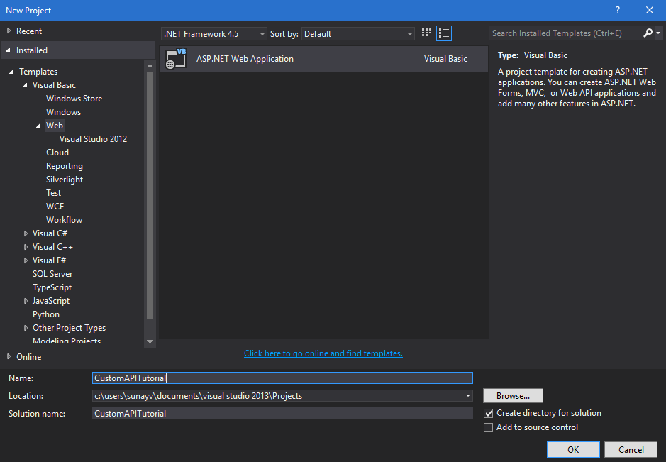

## Create a AAD protected WebAPI using Azure Webapps and register it for PowerApps.

This tutorial aims to teach you how to create a WebAPI and host it on Azure Webapps, enable AAD authentication (via easy auth) on it and then register the WebAPI in PowerApps and Logic flows. 

### Pre-requisites

* An Azure subscription
* A PowerApps account
* Visual studio 2013 or higher

####Step 1: Creating a WebAPI and deploying it on Azure
1. Start off by launching visual studio and create a new ASP.NET web application.


2. On the next screen select the web API template. 
>[Important] Make sure you set authentication to "No Authentication"


3. Once your project has been created, you will need to build the web API for your resources. For this tutorial, we will not go in to the specifics of building a web API
4. The next step for us is to generate a swagger file for the web API. You can do this easily by bringing up the __Package Manager Console__ and installing __Swashbuckle__

5. Once installed and enabled, you should be able to browse the following Swagger docs and UI endpoints respectively:
 **\<your-root-url\>/swagger/docs/v1**

 **\<your-root-url\>/swagger**

6. Once you are comfortable with your web API, you will need to publish it to the Azure cloud. You can do this by going to **BUILD** > **PUBLISH** in visual studio.
7. Extract the swagger json by navigating to ***https://\<azure-webapp-url\>/swagger/docs/v1***


####Step 2: Setting up AAD authentication. 

This tutorial assumes you know how to create an AAD application in Azure. If you want to learn more about how to create an AAD application, [read this first](https://github.com/logicappsio/CustomAPIs/tree/master/AzureResourceManager#authentication). We will need to create two AAD applications for the purpose of this tutorial. 

1. The first one will be used to secure the web API. We will call it **webAPI**
2. The second AAD application will be used to secure the custom API registration and acquire delegated access to the web API protected by the first app. We will call this one **webAPI-customAPI** 
3. For **webAPI**, use the following configuration:
  1. Sign-on url: ***https://login.windows.net***
  2. App-ID Uri: ***https://\<your-root-url\>*** (typically the url of your website deployed on Azure)
  3. Reply url: ***https://\<your-root-url\>/.auth/login/aad/callback***
  4. You will need the Client ID of this app later so make a note of it

4. For **webAPI-customAPI**, use the following configuration:
  
  1. Sign-on url: **https://login.windows.net**
  2. App-ID Uri: ***can be any unique URL***
  3. Reply url: ***https://msmanaged-na.consent.azure-apim.net/redirect***
  4. Add permissions to have delegated access to webAPI.
  5. You will need the Client ID of this app later as well, so make a note of it
  6. Generate a key and store is somewhere safe. We will need this later

>[Important] Both apps must be in the same directory.

####Step 3: Setting up easy auth on your Webapp

1. Log in to the new azure portal and navigate to your webapp that you deployed as part of the step 1
2. On the ***Settings*** blade scroll down to find ***"Authentication / Authorization"*** item
3. Turn on ***App Service Authentication*** and select ***Azure Active Directory***. Select ***Express*** on the next blade
4. Click on the ***Select Existing AD App*** and select the first AAD application you created as part of step two. In this case: ***webAPI***

This should setup AAD authentication for you webapp.

####Step 4: Setting up the Custom API. 

1. We will need to modify our swagger a bit to specify the securityDefintion object and AAD authentication used for the Webapp. Add the following lines of code: 

```javascript
  "host": "<your-root-url>",
  "schemes": [
    "https"						//Change scheme to https 
  ],
  "securityDefinitions": {
    "AAD": {
      "type": "oauth2",
      "flow": "implicit",
      "authorizationUrl": "https://login.windows.net/common/oauth2/authorize",
      "scopes": []
    }
  },
```
2. Navigate to the PowerApps [web portal](https://web.powerapps.com) and launch the create custom API wizard. If you don't know how, [read this first](https://github.com/logicappsio/CustomAPIs#how-to-create-a-custom-API).
3. Once you have uploaded your Swagger, the wizard will auto-detect that you are using AAD authentication for your webAPI.
4. Configure the AAD authentication for your custom API as follows:
  1. Client ID: ***Client ID of webAPI-CustomAPI*** from 4.5 in step 2
  2. Secret: ***Key from webPI-CustomAPI*** from 4.6 in step 2
  3. Login url: ***https://login.windows.net***
  4. ResourceUri: ***Client ID of webAPI*** from 3.4 in step 2
5. Hit create and try creating a connection on the Custom API. If everything was setup correctly, you should be able to sign-in successfully. 


In case you have any questions or comments feel free to reach out to us at [logicappsio@microsoft.com](mailto:logicappsio@microsoft.com)
